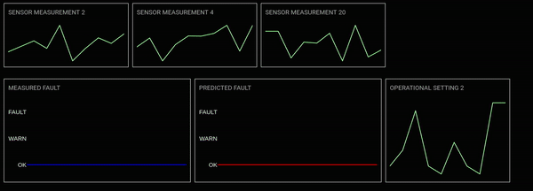

# Fault Detection of JET engine

*Reading an article *Damage Propagation Modelling for Aircraft Engine Run-to-Failure Simulation* and trying to reformat
it into a fault detection pipeline of a jet engine, with the help of C-MAPPS dataset and reccurent neural networks.*

[](app/assets/image.png)

## Installation

Download the project from GitHub and change your current directory:

```
$ (base) cd c-mapps
```

Use a virtual environment to isolate your environment, and install the required dependencies.

```
$ (base) python3 -m venv venv
$ (base) source venv/bin/activate
$ (venv) pip3 install -r requirements.txt
```

To start Fault Detector app, simply write:

```
$ (venv) python3 app/visualisation.py
```
[](app/assets/dash_app.gif)

For demonstration purposes, the model currently predicts a **fault vector**. In a real-world scenario, the model would likely predict a **fault scalar**.

This scalar would represent the overall fault classification (e.g., "OK", "Warning", "Fault") based on the current measurements.

## [Modelling report](./modelling/README.md)

## TODO LIST:

- [x] Reformat the RUL problem to a fault detection (0 - ok, 1 - warning, 2-fault)
- [x] Train a sufficient lightweight models
- [x] Implement a Dash app that allows model inference and helps understand the problem
- [ ] Implement Neural Architecture Search (NAS) for each JET engine
- [x] Evaluate models predictions ([Residuals](modelling/README.md#residuals))
- [ ] Explainable AI ([Sensor importance list for each engine]())