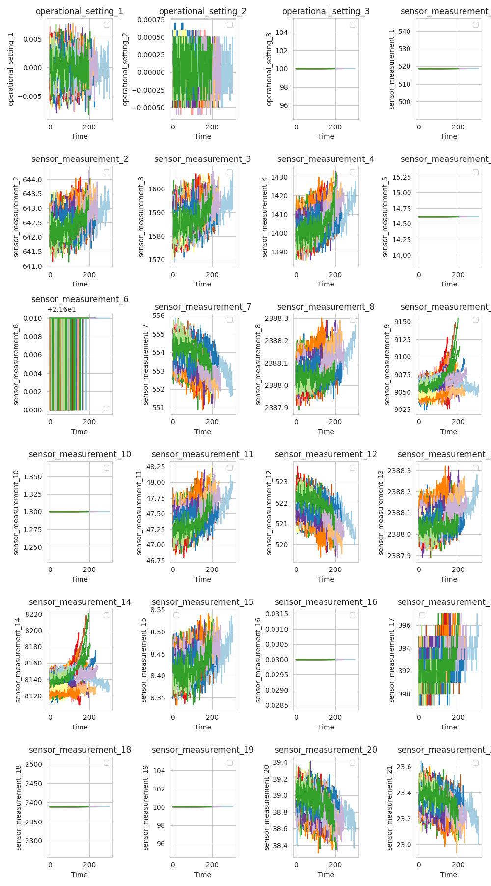
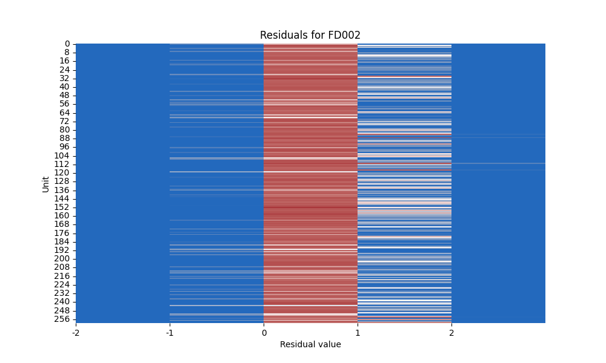

# Exploratory Data Analysis

+ 4 Datasets (FD001-4) consist of multiple multivariate series.
+ Each dataset has 3 operational settings and number of
  sensor measurements which are contaminated with noise over time.
+ Taking a look at example of sensor measurements for **FD001** jet, we can see non-linear trends in some, caused by
  noises in sensors.
+ Since the non-linearity holds, neural network approach should be advised.

## Measurements visualization of dataset FD001

# Modelling

+ We want to build a RNN that can handle a stream of sensor measurements and produce a one-hot-encoded vector in real
  time.
+ Each jet supposedly has different type and number of sensor measurements. Each unit has a different number of time
  cycles. Therefore, we will make a model for each of the jets.
+ We can structure the data such that each unit's data is treated as a separate sequence and train our *batches* like
  that.
+ **Reformat the problem**: If we can model the RUL of a certain jet, we should be able to split the measurements to *
  *INFO -> WARNING -> FAULT**.

## Modelling problems and solutions

+ Measurements classification splitting (*garbage-in, garbage-out*). It's a subject matter expertise knowledge to decide
  when the model should be warned and when does the fault start.
+ Our base model was prone to the overfitting, we also got double descent at 130 epochs, probably because of over
  parametrization of the model, since the dataset is relatively small.
+ We solved some of the overfitting problems by:
    + implementing early stopping (*patience*)
    + increasing dropout rates in model layers
    + keeping model complexity reduced to only a few layers
    + adding **L2** regularization penalties
+ Validation calculation is slow and should be optimized for bigger datasets.
+ Classes 0,1 and 2 are not evenly distributed.

## Model architecture

---
## Train / validation losses

|                                                    FDOO1                                                    |                                                    FD002                                                    | FD003                                                                                                       | FD004                                                                                                       |
|:-----------------------------------------------------------------------------------------------------------:|:-----------------------------------------------------------------------------------------------------------:|-------------------------------------------------------------------------------------------------------------|-------------------------------------------------------------------------------------------------------------|
|  |  |  |  |                                                                                       |                                                                                       |

---
## Residuals

|                                              FDOO1                                              |                                                    FD002                                                    | FD003                                                                                                       | FD004                                                                                                       |
|:-----------------------------------------------------------------------------------------------:|:-----------------------------------------------------------------------------------------------------------:|-------------------------------------------------------------------------------------------------------------|-------------------------------------------------------------------------------------------------------------|
|  |  |  |  |                                                                                       |                                                                                       |

Residual is calculated as:`prediction - target`:
+ In our case, when we subtract target vector from prediction vector, we get a set of values `{-2, -1, 0, 1, 2}`:
  + `0` is our goal, since it means that the prediction is the same as the target
  + Since models are lightweight and not perfect, we agree to make our models a bit more sensitive (skewness to the right in the residuals graphs), so that in real life, the prediction of fault would come earlier than the actual fault.